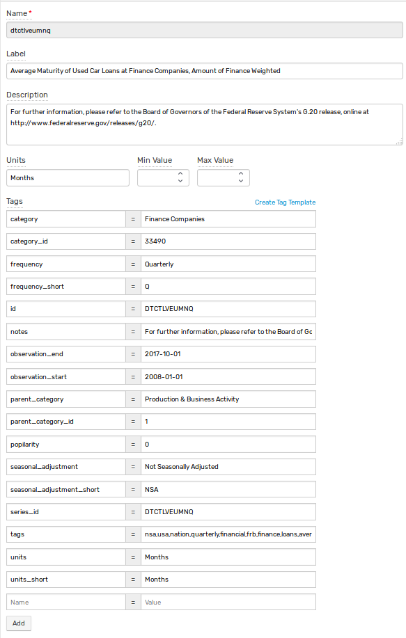

# Fred Crawler

## Description

Collects series data from https://api.stlouisfed.org/fred/ in specified set of categories and load int into ATSD.
It stores FRED® series metadata to ATSD metric metadata, and FRED® series observations to the series of ATSD metric.

Series `fred/series`:

```json
{
  "realtime_start": "2018-05-15",
  "realtime_end": "2018-05-15",
  "seriess": [
    {
      "id": "DTCTLVEUMNQ",
      "realtime_start": "2018-05-15",
      "realtime_end": "2018-05-15",
      "title": "Average Maturity of Used Car Loans at Finance Companies, Amount of Finance Weighted",
      "observation_start": "2008-01-01",
      "observation_end": "2017-10-01",
      "frequency": "Quarterly",
      "frequency_short": "Q",
      "units": "Months",
      "units_short": "Months",
      "seasonal_adjustment": "Not Seasonally Adjusted",
      "seasonal_adjustment_short": "NSA",
      "last_updated": "2018-03-30 12:51:01-05",
      "popularity": 16,
      "notes": "For further information, please refer to the Board of Governors of the Federal Reserve System's G.20 release, online at http://www.federalreserve.gov/releases/g20/."
    }
  ]
}
```

Tags `fred/series/tags`:

```json
{
  "realtime_start": "2018-05-15",
  "realtime_end": "2018-05-15",
  "order_by": "series_count",
  "sort_order": "desc",
  "count": 16,
  "offset": 0,
  "limit": 1000,
  "tags": [
    {
      "name": "nsa",
      "group_id": "seas",
      "notes": "Not Seasonally Adjusted",
      "created": "2012-02-27 10:18:19-06",
      "popularity": 100,
      "series_count": 446920
    },
    {
      "name": "usa",
      "group_id": "geo",
      "notes": "United States of America",
      "created": "2012-02-27 10:18:19-06",
      "popularity": 98,
      "series_count": 368053
    },
  ...
}
```

Resulting metric:



## Configuration

Crawler reads configuration from two files

1. `config.json` contains JSON object with following fields

   | Field | Description |
   |-------|-------------|
   | `apiKey` | [API Key](https://research.stlouisfed.org/docs/api/api_key.html) to access FRED® API. |
   | `minimalObservationEnd` | Date in `yyyy-MM-dd` format. Series that have `observation_end` before this date will be discarded. |
   | `traceCommands` | `true` of `false`. Network API commands will be recoreded into `commands.txt` when set to true. | 
   | `rootCategories` | List of category IDs. Series in these and all of the nested categories will be processed. |
   
   ```json
   {
     "minimalObservationEnd": "2014-01-01",
     "apiKey": "abcdefghijklmnopqrstuvwxyz123456",
     "traceCommands": false,
     "rootCategories": [1, 2, 9, 10]
   }
   ```
   
2. `client.properties` follows ATSD Java API library format. See [documentation](https://github.com/axibase/atsd-api-java) for details.

   ```ls
   axibase.tsd.api.server.port=8443
   axibase.tsd.api.protocol=https
   axibase.tsd.api.server.name=atsd.example.com
   axibase.tsd.api.username=axibase
   axibase.tsd.api.password=axibase
   ```

## Logging

Log file `crawler.log` contains contains information about series updates and creates in following format

```text
date,series_id,action,stored_end_date,available_end_date
```

Where `action` can be one of `skip`, `create` and `update`. `stored_end_date` is empty in case series wasn't stored into ATSD before.

Examples

```
2018-05-17 07:10:36.366,REVENF523XALLEST,skip,,2007-01-01
2018-05-17 07:10:36.488,LEU0254495800A,skip,2017-01-01,2017-01-01
2018-05-17 07:10:36.574,LEU0254703700A,create,,2017-01-01
2018-05-17 07:10:36.621,JTU5300TSR,update,2018-02-01,2018-03-01
```
